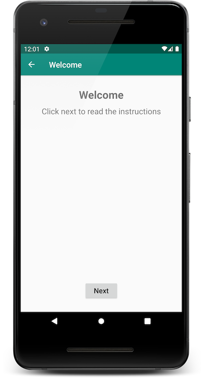
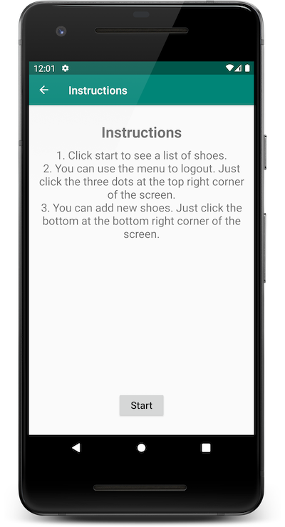
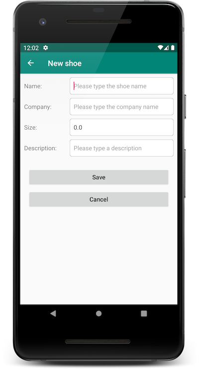

# Shoe Store

I created this Android app for the purposes of the [Udacity's Developing Android Apps with Kotlin Nanodegree Program](https://www.udacity.com/course/android-kotlin-developer-nanodegree--nd940) to showcase my skills in **Android developement**.

## How to Run the app

- Clone the **[repo](https://github.com/anastasioscho/udacity-shoe-store.git)**.
- Open Android Studio.
- Select Open an Existing Project.
- Locate the project folder and click Open.
- Click the Run button.

## Some of the Technologies and Techniques Used

* [ViewModel](https://developer.android.com/topic/libraries/architecture/viewmodel)
* [LiveData](https://developer.android.com/topic/libraries/architecture/livedata)
* [Data Binding](https://developer.android.com/topic/libraries/data-binding)
* [Navigation Component](https://developer.android.com/guide/navigation/navigation-getting-started)
* [ConstraintLayout](https://developer.android.com/training/constraint-layout)

## Screenshots

    

